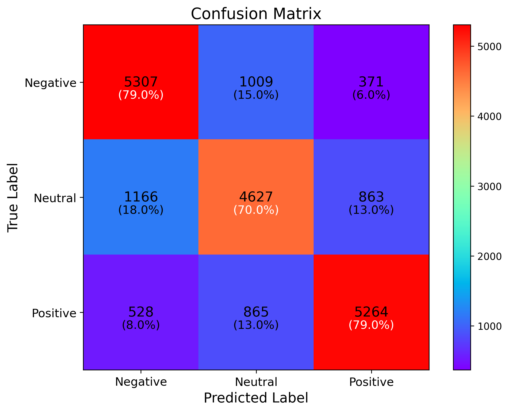

# YouTube Comment Sentiment Analysis

Fine-tuning Twitter-RoBERTa to classify YouTube comments as **Negative**, **Neutral**, or **Positive**.

The project uses a deterministic sample of 100,000 comments, translates non-English text, and adapts a transformer pretrained on social-media language. The final held-out test result was **75.99% accuracy** with **0.7597 macro F1**.

## Results

| Metric | Value |
|---|---:|
| Accuracy | 75.99% |
| Macro F1 | 0.7597 |
| Macro precision | 0.7600 |
| Macro recall | 0.7598 |

Per-class F1 scores were 0.78 for Negative, 0.70 for Neutral, and 0.80 for Positive comments.



## Repository contents

```text
.
├── artifacts/              # Lightweight final metrics and figures
├── data/processed/         # Reusable translation cache
├── notebooks/              # Data exploration and modeling notebooks
├── report/                 # Original project presentation
├── DATA_LICENSE.md
├── README.md
└── requirements.txt
```

## Notebook outputs

The main notebook keeps outputs that help a reviewer assess the work: the final metrics, classification report, confusion matrix, etc. 

## Reproduce the project

Python 3.11 and a CUDA-capable GPU are recommended.

```bash
python -m venv .venv
source .venv/bin/activate
python -m pip install --upgrade pip
python -m pip install -r requirements.txt
jupyter lab
```

Run the notebooks in this order:

1. `notebooks/data_exploration.ipynb` reproduces the descriptive statistics and visuals used in the presentation
2. `notebooks/sentiment_analysis.ipynb` handles translation, fine-tuning, evaluation, and inference

Two flags near the top control expensive work:

- `FORCE_RETRANSLATE = False`: uses the checked-in translation cache. Regeneration can take approximately 2 h.
- `FORCE_RETRAIN = False`: loads `extras/model_checkpoint/` when available, otherwise it trains the model for 3 epochs and creates that ignored folder.

The Hugging Face dataset is currently public. If authentication is needed in another environment, use `huggingface_hub.login()`

## Data and model

- Dataset: [YouTube Comments Sentiment Analysis Dataset](https://huggingface.co/datasets/AmaanP314/youtube-comment-sentiment), 1,032,225 rows, licensed under CC BY-SA 4.0.
- Base model: [cardiffnlp/twitter-roberta-base-sentiment-latest](https://huggingface.co/cardiffnlp/twitter-roberta-base-sentiment-latest), licensed under CC BY 4.0.
- Presentation: [Sentiment Analysis on YouTube Comments](report/Sentiment_Analysis_YT_Comments.pdf).

The translation cache is derived from the cited dataset and retains its attribution and share-alike requirements; see [DATA_LICENSE.md](DATA_LICENSE.md).

## Method summary

1. Download and verify the source dataset
2. Draw a deterministic 100,000-row sample
3. Detect language with FastText and selectively translate comments to English
4. Normalize URLs, mentions, hashtags, whitespace, and emojis
5. Fine-tune Twitter-RoBERTa for three epochs, freezing its embeddings and first four encoder layers
6. Evaluate on a stratified 20% test split

## Limitations

- The labels combine automated sentiment labeling and manual validation
- The source dataset includes augmented and repeated comments
- The experiment uses a random row-level split, not a group split by video
- Translation quality was not manually evaluated
- There is no separate validation split because this repository preserves the original experiment design
- The result should be treated as a portfolio experiment, not a production benchmark
